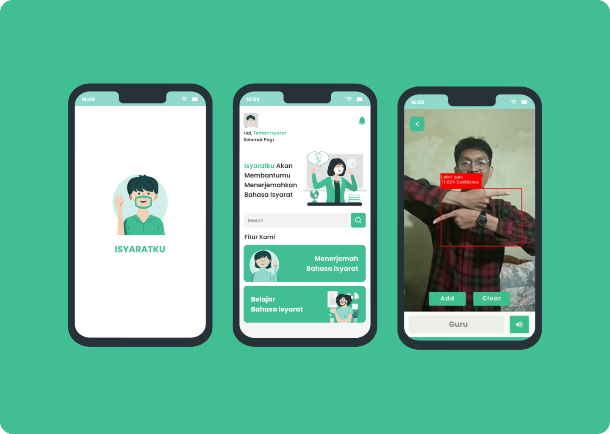

# Isyaratku

<!-- About the Project -->
## :star2: About the Project

My Thesis project, ISYARATKU is a real-time Indonesian Sign Language translator application using the [YOLOv5 method](https://github.com/ultralytics/yolov5), designed to assist who struggle to understand sign language's 

<!-- Screenshots -->
### :camera: Screenshoots & Preview

-User Interfaces

 
  

-Preview  

<!-- Features -->
### :dart: Features

- Feature 1 : Translate Indonesian Sign Languages
- Feature 2 : Learning Indonesian Sign Languages

### :space_invader: Tech Stack & Open-source libraries

- Minimum SDK level 22
- YOLOv5
- 100% [Kotlin](https://kotlinlang.org/) based + [Coroutines](https://github.com/Kotlin/kotlinx.coroutines)
- JetPack
  - Lifecycle - dispose observing data when lifecycle state changes.
  - ViewModel - UI related data holder, lifecycle aware.
- Architecture
  - MVVM Architecture (View - DataBinding - ViewModel - Model)
- Material Design
- Tensorflow Lite
- CameraX
- Picasso
